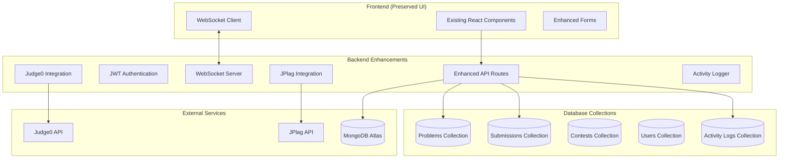

# CodeContest Pro Enhancement - Design Document

## Overview

This design document outlines the comprehensive enhancement of the CodeContest Pro platform, focusing on implementing a complete problem database, real solution verification, plagiarism detection, activity logging, and real-time features while maintaining the existing UI structure.

## Architecture

### Enhanced System Components



## Components and Interfaces

### 1. Problem Database Component

**Purpose**: Manage comprehensive problem collection with test cases and metadata

**Problem Schema Enhancement**:
```javascript
{
  _id: ObjectId,
  title: String,
  description: String,
  inputFormat: String,
  outputFormat: String,
  constraints: String,
  difficulty: String, // 'Easy', 'Medium', 'Hard'
  category: String, // 'Arrays', 'Trees', 'Graphs', etc.
  tags: [String],
  examples: [{
    input: String,
    output: String,
    explanation: String
  }],
  testCases: [{
    input: String,
    expectedOutput: String,
    isPublic: Boolean,
    points: Number
  }],
  timeLimit: Number, // seconds
  memoryLimit: Number, // MB
  source: String, // Attribution
  createdBy: ObjectId,
  createdAt: Date,
  statistics: {
    totalSubmissions: Number,
    acceptedSubmissions: Number,
    acceptanceRate: Number
  }
}
```

### 2. Enhanced Submission System

**Purpose**: Complete submission lifecycle with real execution and results

**Enhanced Submission Schema**:
```javascript
{
  _id: ObjectId,
  userId: ObjectId,
  problemId: ObjectId,
  contestId: ObjectId,
  code: String,
  language: String,
  status: String, // 'pending', 'running', 'accepted', 'wrong_answer', 'tle', 'mle', 'runtime_error', 'compile_error'
  score: Number,
  executionResults: [{
    testCaseId: ObjectId,
    status: String,
    executionTime: Number,
    memoryUsed: Number,
    input: String,
    expectedOutput: String,
    actualOutput: String,
    errorMessage: String
  }],
  plagiarismCheck: {
    checked: Boolean,
    score: Number,
    similarSubmissions: [{
      submissionId: ObjectId,
      similarity: Number,
      details: String
    }],
    checkedAt: Date
  },
  judge0Token: String,
  submittedAt: Date,
  processedAt: Date
}
```

### 3. Activity Logging System

**Purpose**: Comprehensive audit trail and real-time activity tracking

**Activity Log Schema**:
```javascript
{
  _id: ObjectId,
  userId: ObjectId,
  action: String, // 'contest_created', 'problem_added', 'submission_made', 'plagiarism_detected'
  entityType: String, // 'contest', 'problem', 'submission'
  entityId: ObjectId,
  details: {
    contestId: ObjectId,
    problemId: ObjectId,
    submissionId: ObjectId,
    metadata: Object
  },
  timestamp: Date,
  ipAddress: String,
  userAgent: String
}
```

### 4. Real-time WebSocket Enhancement

**Purpose**: Live updates for all platform activities

**WebSocket Events**:
- `leaderboard_update`: Contest ranking changes
- `submission_result`: Individual submission results
- `plagiarism_alert`: Plagiarism detection notifications
- `activity_update`: Real-time activity feed
- `contest_update`: Contest status changes

## Data Models

### Enhanced Problem Categories

**Arrays (25 problems)**:
- Two Sum, Three Sum, Maximum Subarray
- Rotate Array, Remove Duplicates
- Merge Sorted Arrays, etc.

**Linked Lists (20 problems)**:
- Reverse Linked List, Merge Two Lists
- Detect Cycle, Remove Nth Node
- Intersection of Lists, etc.

**Trees (30 problems)**:
- Binary Tree Traversal, Maximum Depth
- Validate BST, Lowest Common Ancestor
- Path Sum, Serialize/Deserialize, etc.

**Graphs (25 problems)**:
- DFS/BFS, Shortest Path
- Topological Sort, Connected Components
- Minimum Spanning Tree, etc.

**Dynamic Programming (30 problems)**:
- Fibonacci, Coin Change, Knapsack
- Longest Common Subsequence
- Edit Distance, etc.

**Stacks/Queues (20 problems)**:
- Valid Parentheses, Min Stack
- Implement Queue using Stacks
- Sliding Window Maximum, etc.

**Hashing (25 problems)**:
- Group Anagrams, First Unique Character
- Subarray Sum Equals K
- Longest Substring Without Repeating, etc.

**Other Data Structures (25 problems)**:
- Heap operations, Trie implementation
- Union-Find, Segment Trees, etc.

## Implementation Strategy

### Phase 1: Problem Database Population

1. **Problem Collection Script**:
   - Automated scraping from open-source repositories
   - Manual curation and verification
   - Test case generation and validation

2. **Database Seeding**:
   - Bulk import functionality
   - Problem categorization and tagging
   - Difficulty assignment based on complexity

### Phase 2: Enhanced Submission System

1. **Judge0 Integration**:
   - Real code execution pipeline
   - Multiple language support
   - Resource limit enforcement

2. **Result Processing**:
   - Test case evaluation
   - Performance metrics collection
   - Error handling and reporting

### Phase 3: Plagiarism Detection

1. **JPlag Integration**:
   - Automated similarity analysis
   - Threshold-based flagging
   - Detailed comparison reports

2. **Fallback System**:
   - Local similarity algorithms
   - Code structure analysis
   - Pattern matching techniques

### Phase 4: Real-time Features

1. **WebSocket Enhancement**:
   - Event-driven updates
   - Room-based broadcasting
   - Connection management

2. **Activity Logging**:
   - Comprehensive action tracking
   - Real-time feed generation
   - Analytics data collection

## Security Considerations

### Authentication Enhancement

1. **Password Security**:
   - bcrypt with salt rounds 12
   - Password strength validation
   - Account lockout mechanisms

2. **JWT Security**:
   - Short-lived access tokens
   - Refresh token rotation
   - Secure token storage

3. **API Security**:
   - Rate limiting per endpoint
   - Input validation and sanitization
   - SQL injection prevention

### Data Protection

1. **Submission Security**:
   - Code encryption at rest
   - Secure execution environment
   - Result integrity verification

2. **Privacy Protection**:
   - User data anonymization
   - GDPR compliance measures
   - Audit trail protection

## Performance Optimization

### Database Optimization

1. **Indexing Strategy**:
   - Compound indexes for queries
   - Text indexes for search
   - TTL indexes for temporary data

2. **Query Optimization**:
   - Aggregation pipelines
   - Projection optimization
   - Connection pooling

### Caching Strategy

1. **Problem Caching**:
   - Frequently accessed problems
   - Test case caching
   - Result memoization

2. **Session Caching**:
   - User session data
   - Authentication tokens
   - Temporary results

## Testing Strategy

### Unit Testing

1. **API Endpoints**:
   - Authentication flows
   - CRUD operations
   - Error handling

2. **Business Logic**:
   - Submission processing
   - Plagiarism detection
   - Scoring algorithms

### Integration Testing

1. **External Services**:
   - Judge0 API integration
   - JPlag API integration
   - Database operations

2. **Real-time Features**:
   - WebSocket connections
   - Event broadcasting
   - Concurrent user handling

### Load Testing

1. **Concurrent Submissions**:
   - Multiple users submitting simultaneously
   - Queue management
   - Resource utilization

2. **Real-time Updates**:
   - WebSocket scalability
   - Event propagation
   - Memory usage optimization

## Deployment Considerations

### Environment Configuration

1. **Production Settings**:
   - Environment variable management
   - Service configuration
   - Monitoring setup

2. **Scaling Preparation**:
   - Horizontal scaling readiness
   - Load balancer configuration
   - Database sharding strategy

### Monitoring and Logging

1. **Application Monitoring**:
   - Performance metrics
   - Error tracking
   - User activity monitoring

2. **System Health**:
   - Resource utilization
   - Service availability
   - Database performance